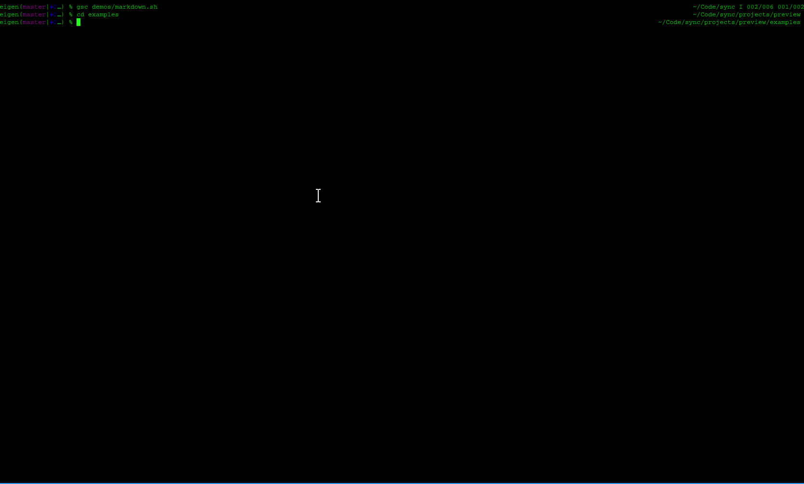
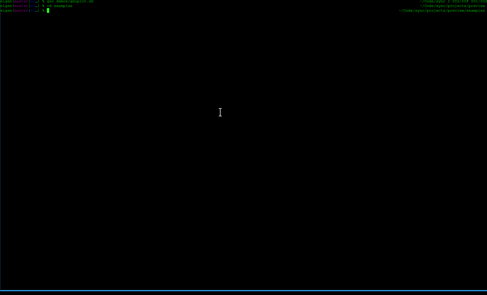
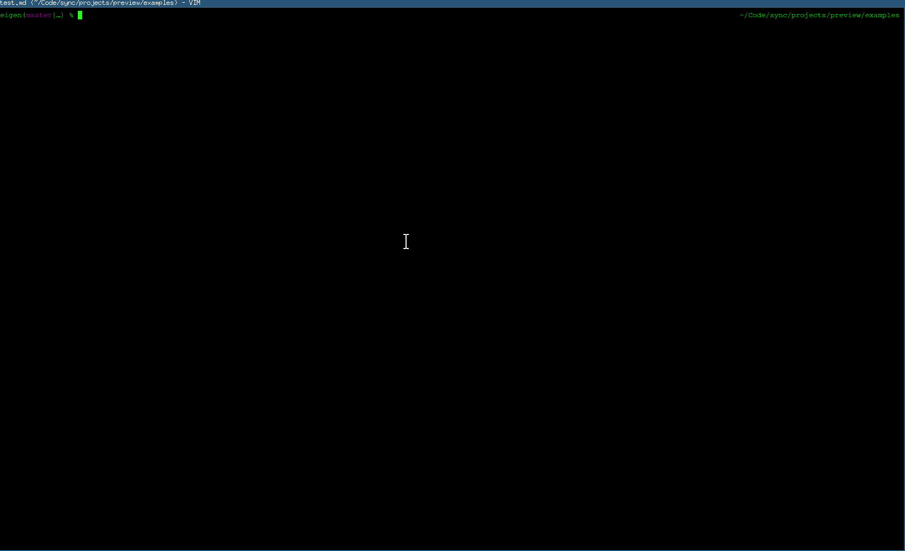

# `preview`

`preview` is a simple bash script that allows you to preview a
file/document/image that is generated from a source file. For example, if you
are writing a Markdown file and you want to see a preview of what it will look
like in HTML. There are many situations when this is useful, here are a just a
few of the ones that motivated this script

- Markdown : The most common scenario. I use `vim` and couldn't find a good markdown previewer that I liked.
- gnuplot : It is nice to be able to see a preview of a plot generated with gnuplot while editing the script.
- Latex Snippets : I use LaTeX/circuitikz to create circuit diagrams and `tex2im` to create the image files. `preview` lets me see the image while I edit the LaTeX.

Several good tools for previewing certain types of files already exist.
For example, [`grip`](https://github.com/joeyespo/grip) provides a GitHub-README-style preview of markdown files.
`preview` does not replace these, it just provides a uniform interface to using them.

**Features:**

- Small, simple bash script.
- Handles a wide variety of use cases with Makefile-based handlers.
- Easily override default handler for all files in a directory.
- Monitor _multiple_ files for changes to trigger preview update.
- Easily integrates with text editors that support async job control (vim/nvim, emacs, etc.)

## Install

`preview` is a single bash script. To install it, you just need to make it executable and put it in a directory in your `PATH` variable. You can also run the `./install.sh` script
to automate this, which will also check that `entr` is installed and offer to install it if not. For example, in a docker shell:
```
root@8119d82073e2:/home/sandbox/cwd# bash install.sh 
Found the following (writable) directories in your PATH.
install.sh: line 32: cancel: command not found
If you would like to install to a different directory, select , add it to your PATH, and rerun.
1) cancel
2) /bin
3) /sbin
4) /usr/bin
5) /usr/local/bin
6) /usr/local/sbin
7) /usr/sbin
Which directory would you like to install into? 4
Installing 'preview' into '/usr/bin'
The 'entr' command is required by 'preview', but was not found. Would you like to install it?
Y/n: y
Downloading 'entr' source to '/tmp/tmp.SskiRxvA5L'.
cp Makefile.linux Makefile
cc  -D_GNU_SOURCE -D_LINUX_PORT -Imissing -DRELEASE=\"5.0\"  missing/strlcpy.c missing/kqueue_inotify.c entr_spec.c -o entr_spec
cc  -D_GNU_SOURCE -D_LINUX_PORT -Imissing -DRELEASE=\"5.0\"  missing/strlcpy.c missing/kqueue_inotify.c entr.c -o entr
Running unit tests
Xsh returned exit code 86
26 of 26 tests PASSED
install entr /tmp/tmp.SskiRxvA5L/entr-5.0/bin
install -m 644 entr.1 /tmp/tmp.SskiRxvA5L/entr-5.0/share/man/man1
Installed 'entr' into '/usr/bin'.
root@8119d82073e2:/home/sandbox/cwd# 
```

## What it does

`preview` uses `entr` to trigger commands when a file is updated. A `Makefile` is used to execute the commands, so it is completely customizable. All that
is needed for preview to work is a `Makefile` that contains 5 targets (it may define more that 5, but these are the five that will be used).

- setup : `make setup` is ran before the view process is started.
- start : `make start` is ran to start a process for viewing the preview (i.e. a PDF viewer or browser).
- refresh : `make refresh` is ran every time the source file is modified (using `entr`).
- stop : `make stop` is ran when `preview` recieves a `SIGTERM` (i.e. ctrl-c).
- cleanup : `make cleanup` is ran after the processes started by `make start` terminates.

`preview` simply does a little bit of work so that a refresh occur when the source file being "previewed" is modified, so the preview
can be updated automatically.

## Makefiles

`preview` looks for a `Makefile` to use in several different places. The following files are looked for in the order listed. The first one found is
used:

- A file named `Makefile.${ext}`, where `${ext}` is the extension of the source file, in the directory of the source file.
- A file named `Makefile.${ext}`, where `${ext}` is the extension of the source file, in the directory `~/.preview`.
- A file named `Makefile` in the directory of the source file.
- A file named `Makefile` in the directory `~/.preview`.

If no `Makefile` can be found, then a default `Makefile` (stored in the script itself) is used. The default `Makefile` previews Markdown using
`pandoc` to generate PDF file and opens it using the `zathura` PDF viewer.

## Examples

### Markdown

This Makefile will compile a Markdown file to PDF, using the `pandoc` document converter, 
and open it in `zathura`. When the Markdown file is modified, `preview` will automatically
recompile the PDF.

```
build:
	pandoc -f markdown -t latex -o $(TMPDIR)/$(INFILE_STEM).pdf $(INFILE)

setup: build

start:
	zathura $(TMPDIR)/$(INFILE_STEM).pdf 1>/dev/null 2>/dev/null

refresh: build
```
To preview a file named `notes.md`, create a Makefile named `Makefile.md` in the same directory
and run
```
$ preview notes.md
```
You can increase the verbosity to see the output of commands
```
$ preview -v -v -v notes.md
[debug] Using '/home/cclark/.preview/Makefile.md' for makefile
[debug] make -f /home/cclark/.preview/Makefile.md INFILE=/home/cclark/Code/sync/projects/preview/README.md INFILE_ABS=/home/cclark/Code/sync/projects/preview/README.md INFILE_NAME=README.md INFILE_EXT=md INFILE_STEM=README INDIR=/home/cclark/Code/sync/projects/preview TMPDIR=/tmp/tmp.vpy4ppWySC
[] variables:
[] INFILE_ABS: /home/cclark/Code/sync/projects/preview/README.md
[] INFILE_NAME: README.md
[] INFILE_STEM: README
[] INFILE_EXT: md
[] INFILE: /home/cclark/Code/sync/projects/preview/README.md
[] LOGFILE: ./preview.log
[] INDIR: /home/cclark/Code/sync/projects/preview
[] TMPDIR: /tmp/tmp.vpy4ppWySC
[debug] entr PID: 1656962
[debug] start PID: 1656954
[debug] Running 'make cleanup'...
[debug] Making sure child processed have been cleaned up...
```



### Gnuplot

This Makefile will generate a PNG image from a Gnuplot script and open it in `feh`, which is configured to refresh every 2 seconds.

```
build:
	gnuplot -e 'set term png; set output "$(TMPDIR)/$(INFILE_STEM).png"' $(INFILE_ABS)

setup: build

start:
	feh -R 2 $(TMPDIR)/$(INFILE_STEM).png

refresh: build
```
This is useful for developing scripts to generate figures for a paper (you could generate a postscript or PDF if you prefer), but it does not let you interact with plot window like
a an interactive gnuplot session does. This Makefile will used [sexpect](https://github.com/clarkwang/sexpect) to open a interactive gnuplot session in the background and reload the script
when it changes.
```
setup:

start:
	sexpect -sock preview-gnuplot.sock spawn gnuplot
	zenity --info --no-markup --text="Click 'OK' when you are done to close the preview."
	

refresh:
	sexpect -sock preview-gnuplot.sock send 'load "$(INFILE_ABS)"' -cr
	sexpect -sock preview-gnuplot.sock expect

stop:
	sexpect -sock preview-gnuplot.sock send 'exit' -cr
	sexpect -sock preview-gnuplot.sock wait

cleanup:
	sexpect -sock preview-gnuplot.sock send 'exit' -cr
	sexpect -sock preview-gnuplot.sock wait
```



## Using in an editor

`preview` can be called directly from your favorite text editor using your preferred method for asynchronous job control. For example, the [asyncrun.vim](https://github.com/skywind3000/asyncrun.vim) plugin:

